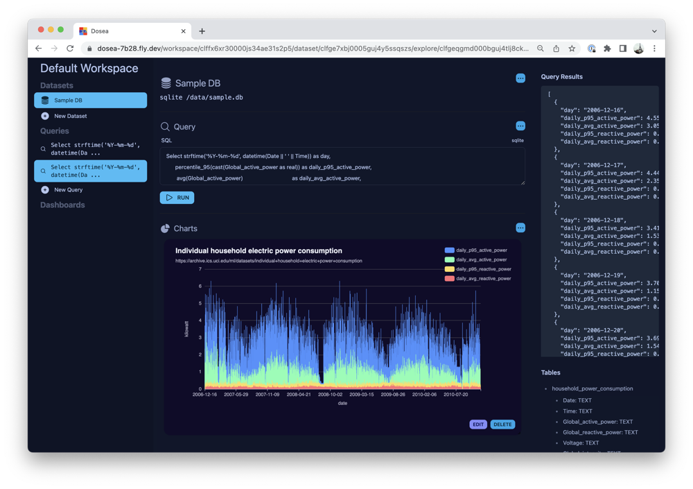

# Dosea

> A dosea (daw-see-ey) for your datasets



Take a gander at the [demo](https://dosea-7b28.fly.dev/).

## Run it at home

Copy the `.env` file and add your information to it.

```sh
cp .env.example .env
```

Install dependencies

```sh
npm install
```

Start dev server:

```sh
npm run dev
```

## Run it in Production

```sh
npm run start
```

## Roadmap

* User Authentication
* Support for postgres, mysql
* Support for influx, prometheus
* Dashboards
* Rich SQL editor with code completion & time range & delta utilities
* Rich chart editor
* Embeddable charts via web components
* Scheduled PDF and email reports

## License

Plausible is open-source under the GNU Affero General Public License Version 3 (AGPLv3) or any later version. You
can [find it here](https://github.com/wmluke/dosea/blob/main/LICENSE.md).
